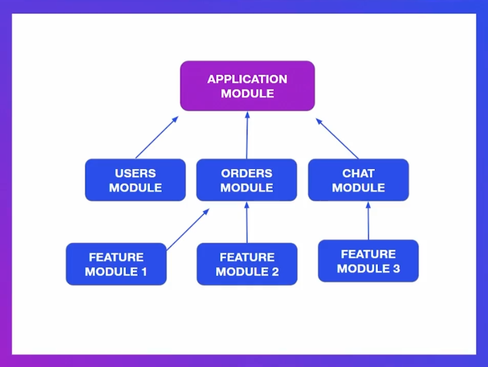
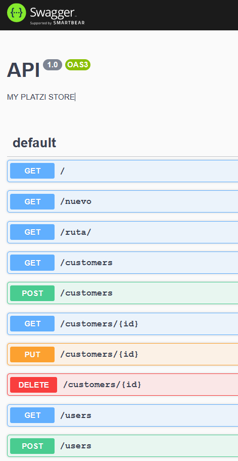
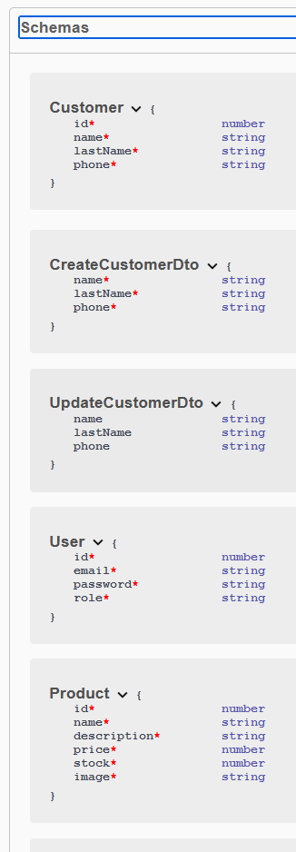
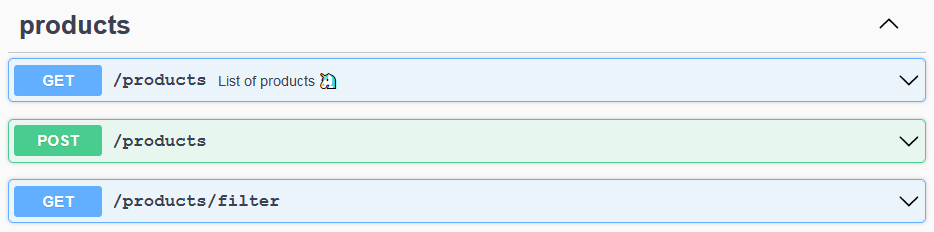

# 89 - Curso de NestJS - Programación Modular

## 1.1 - Instalación del proyecto base

```JS
git remote -v
```

```JS
git remote rm origin
```

```JS
git remote add https://github.com/PCZeroX/nestjs-modular.git
```

```JS

```

## 1.2 - Encapsular lógica en módulos



<https://docs.nestjs.com/cli/usages>

```JS
nest generate module users

// OR

nest g mo users
```

```JS
nest generate module products

// OR

nest g mo products
```

## 1.3 - Overview del proyecto PlatziStore

```JS

```

## 1.4 - Interacción entre módulos

```JS

```

## 1.5 - Entendiendo la inyección de dependencias

```JS

```

## 1.6 - useValue y useClass

```JS
NODE_ENV=prod yarn start:dev
```

> <http://localhost:3000>

Lo vas a usar mucho en testing y lo vas a usar para conexiones

## 1.7 - useFactory

> <https://docs.nestjs.com/techniques/http-module>

```JS

```

## 1.8 - Global Module

```JS
nest g mo database
```

## 2.1 - Módulo de configuración

```JS
npm install @nestjs/config

// OR

yarn add @nestjs/config
```

## 2.2 - Configuración por ambientes

Se crea en la raíz del proyectos estas variables de entorno `.env`, `.prod.env` y `.stag.env`

`.env`

```TS
API_KEY=123
DATABASE_NAME=my_db
```

`stag.env`

```TS
API_KEY=333
DATABASE_NAME=my_db_stag
```

`.prod.env`

```TS
API_KEY=777
DATABASE_NAME=my_db_prod
```

`enviroments.ts`

```TS
export const enviroments = {
  dev: '.env',
  stag: '.stag.env',
  prod: '.prod.env',
}
```

`app.module.ts`

```TS
import { enviroments } from './enviroments';

@Module({
  imports: [
    ConfigModule.forRoot({
      envFilePath: enviroments[process.env.NODE_ENV] || '.env',
      isGlobal: true,
    }),
  ]
})
```

`app.service.ts`

```TS
import { Inject, Injectable } from '@nestjs/common';
import { ConfigService } from '@nestjs/config';

@Injectable()
export class AppService {

  constructor(
    // @Inject('API_KEY') private apiKey: string,
    @Inject('TASKS') private tasks: any[],
    private config: ConfigService,
  ) { }

  getHello(): string {
    const apiKey = this.config.get<string>('API_KEY');
    const name = this.config.get('DATABASE_NAME');
    return `Hello World! ${apiKey} ${name}`
  }
}
```

```JS
NODE_ENV=stag yarn start:dev
```

## 2.3 - Tipado en config

```JS

```

## 2.4 - Validación de esquemas en .envs con Joi

```JS
yarn add joi
```

## 3.1 - Integrando Swagger y PartialType con Open API

> - <https://spec.openapis.org/oas/v3.1.0>
> - <https://docs.nestjs.com/openapi/introduction>

<https://docs.nestjs.com/openapi/introduction#installation>

```JS
npm install --save @nestjs/swagger swagger-ui-express
```

<http://localhost:3000/docs/>



<https://docs.nestjs.com/openapi/cli-plugin#using-the-cli-plugin>

`main.ts`

```JSON
{
  "collection": "@nestjs/schematics",
  "sourceRoot": "src",
  "compilerOptions": {
    "plugins": ["@nestjs/swagger"]
  }
}
```

Paso extra `users/dtos/customer.dto.ts`

```TS
import { IsString, IsNotEmpty, IsPhoneNumber } from 'class-validator';
import { PartialType } from '@nestjs/swagger';
// import { PartialType } from '@nestjs/mapped-types';

export class CreateCustomerDto {
  @IsString()
  @IsNotEmpty()
  readonly name: string;

  @IsString()
  @IsNotEmpty()
  readonly lastName: string;

  @IsPhoneNumber()
  @IsNotEmpty()
  readonly phone: string;
}

export class UpdateCustomerDto extends PartialType(CreateCustomerDto) { }
```

Paso extra `users/dtos/user.dto.ts`

```TS
import { IsString, IsNotEmpty, IsEmail, Length } from 'class-validator';
import { PartialType } from '@nestjs/swagger';
// import { PartialType } from '@nestjs/mapped-types';

export class CreateUserDto {
  @IsString()
  @IsEmail()
  readonly email: string;

  @IsString()
  @IsNotEmpty()
  @Length(6)
  readonly password: string;

  @IsNotEmpty()
  readonly role: string;
}

export class UpdateUserDto extends PartialType(CreateUserDto) { }
```

Prácticamente tienes que cambiarlo en todo los dtos

<http://localhost:3000/docs/>

Se procede a borrar el directorio `dist`

```JS
rm -rf dist/
```

Se vuelve a ingresar a esta dirección de enlace

<http://localhost:3000/docs/>



## 3.2 - Extendiendo la documentación

`products.controller.ts`

```JS
import { ApiTags, ApiOperation } from '@nestjs/swagger';

// ApiTags es para agrupar
@ApiTags('products')

@Controller('products')
export class ProductsController {

  constructor(private productsService: ProductsService) { }

  @Get()
  // Dejar un resumen de este endpoint
  @ApiOperation({ summary: 'List of products 🦄' })
  getProducts(
    @Query('limit') limit: number = 100,
    @Query('offset') offset: number = 0,
    @Query('brand') brand: string
  ) {
    return this.productsService.findAll()
  }
}
```



## 4.1 - Configuración de Heroku

Debemos realizar una configuración de CORS.

CORS es una protección base y default el cual está en los servidores.

En este caso, estamos creando nuestro propio servidor en Node que recibe peticiones de cualquier cliente que puede ser una aplicación de Angular, React, Vue o Android.

Los CORS protegen que se pueda hacer peticiones de cualquier lado.

Suena raro que expongas tu API para que cualquiera me pueda hacer peticiones.

Normalmente, solo se puede hacer peticiones si estás en el mismo servidor, entonces viene configurado con esta protección por defecto.

Si quieres abrir tu API para que puedan solicitar peticiciones (request) de cualquier lado, debes auditar los CORS

```JS
async function bootstrap() {
  app.enableCors();

  await app.listen(3000);
}
bootstrap();
```

Más detalles en el siguiente enlace: <https://docs.nestjs.com/security/cors#cors>

Detalles para hacer deploy en Heroku

<https://devcenter.heroku.com/articles/deploying-nodejs>

`package.json`

```JS
"engines": {
  "node": "14.x"
}
```

`Procfile`

- start es iniciar el proyecto en nest

```JS
web: npm run start

// OR

web: yarn start
```

- start:prod es para producción y es el que usaremos en el archivo `Procfile`

```JS
npm run start:prod

// OR

web: yarn start:prod
```

Usamos el CLI de Heroku

<https://devcenter.heroku.com/articles/heroku-cli>

```JS
heroku login
```

```JS
heroku create
```

`.env`

```JS
API_KEY=123
DATABASE_NAME=my_db
DATABASE_PORT=8091
PORT=3000
```

`.stag.env`

```JS
API_KEY=333
DATABASE_NAME=my_db_stag
DATABASE_PORT=8091
PORT=3000
```

`.prod.env`

```JS
API_KEY=777
DATABASE_NAME=my_db_prod
PORT=3000
```

`main.ts`

```JS
await app.listen(process.env.PORT || 3000);
```

Declaramos el siguiente comando en la terminal para ver si todo está funcionando a nivel local antes de mandar al servidor de Heroku

```JS
heroku local web
```

## 4.2 - Deploy de NestJS en Heroku

Nos pasamos a la rama master

```JS
git checkout master
```

Ahora que estamos en la rama master, nos traemos todo el código que está en la rama 14 para traer todo los cambios

```JS
git merge 14-step
```

```JS
git remote -v
```

```JS
git push heroku master
```

```JS
heroku logs --alll
```

```JS

```

```JS

```

```JS

```

```JS

```

---
